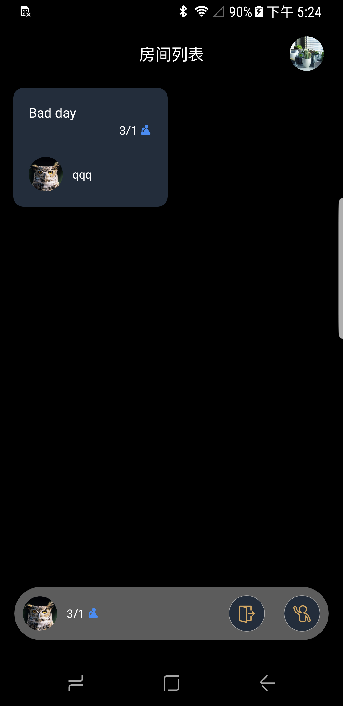

# 前提条件
开始前，请确保你的开发环境满足如下条件：
- Android Studio 4.0.0 或以上版本。
- Android 4.1 或以上版本的设备。部分模拟机可能无法支持本项目的全部功能，所以推荐使用真机。

# 操作步骤
#### 获取示例项目
前往 GitHub 下载或克隆 [Livecast](https://github.com/AgoraIO-Usecase/Livecast) 示例项目。

#### 注册Agora
前往 [Agora官网](https://console.agora.io/) 注册项目，生产appId，然后替换工程**data**中 **strings_config.xml** 中 **app_id**，如果启用了token模式，需要替换**token**。

#### 数据源
- 本项目目前提供了2种数据接入：**leancloud** 和 **firebase**，可以在 Android Studio 的 Build Variants 中进行切换。
- 如果需要自己实现数据源，请参考项目 **data** 代码中实现，主要继承接口 **IDataProvider** 实现具体方法。

##### Leanclould
1. 前往 [Leancloud官网](https://www.leancloud.cn/) 注册项目，生产 appId、appKey、server_url。
- 替换工程 **data** 中  **strings_config.xml** 中 **leancloud_app_id**、**leancloud_app_key**、**leancloud_server_url**。
- 替换 [LeanCloudHelp.py](./LeanCloudHelp.py) 中 **appid** 和 **appkey**。
2. 启用LiveQuery，前往[Leancloud控制台](https://www.leancloud.cn/)，打开[数据存储]-[服务设置]-[启用 LiveQuery]。
3. 安装 [Python](https://www.python.org/)，如果已经安装请忽略。
4. Python安装之后，控制台执行以下命令。
```
pip install leancloud
或者
pip3 install leancloud
```
5. Android Studio Terminal 中执行文件 [LeanCloudHelp.py](./LeanCloudHelp.py)。
```
python ./LeanCloudHelp.py
或者
python3 ./LeanCloudHelp.py
```

##### Firebase
前往 [Firebase官网](https://firebase.google.com/) 注册项目，生成文件 **google-services.json**，然后放到app工程下面。

#### 运行示例项目
1. 开启 Android 设备的开发者选项，通过 USB 连接线将 Android 设备接入电脑。
2. 在 Android Studio 中，点击 Sync Project with Gradle Files 按钮，同步项目。
3. 在 Android Studio 左下角侧边栏中，点击 Build Variants 选择对应的平台。
4. 点击 Run app 按钮。运行一段时间后，应用就安装到 Android 设备上了。
5. 打开应用，即可使用。


